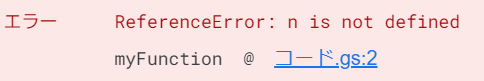

# エラー文
出来ることが増えてくるにつれて、ミスをする確率も上がります。今までの内容を一度もミスせずに行えたならあなたはロボットになるセンスがあります。人間の皆さまは何度もミスを修正しながらプログラムを作成することになります、その際に役立つのがエラー文です。
<br><br>
次のコードを実行してみましょう。

```Javascript
function myFunction() {
  Logger.log(n);
}
```
変数`n`が定義されていないのでエラーになるのは当たり前ですが、重要なのは下に書いてある文章です。  



プログラミング初心者の方は赤文字で<span style="color: red;">エラー</span>などと書かれていては焦ってしまうことでしょう。安心してください、これはあなたの味方です。
<br><br>
エラーの文章をよく見てみると、`n is not defined`と書かれていますね。英語が苦手な方は内容を翻訳機にかけると良いでしょう。`n`が定義されていないというそのまま答えを教えてくれていますね。さらに`コード.gs:2`の部分はハイパーリンクになっていて、クリックすれば自動でエラーが発生した行にワープしてくれます。
エラーが発生した場合は落ち着てエラー文の内容を読み、その原因を探すことが重要です。
<br><br>
ただし注意点もあり、このエラー文は万能ではありません。コードが複雑になるにつれてエラー文から間違っている箇所が推察しづらかったり、該当箇所の行数が間違っていることもあります。過信は禁物です。
<br><br>
特にGASやJavaScript、Pythonなどはインタプリタというプログラミング言語の区分に分けられていて、その性質上エラー文が簡素になりやすいです。
<br><br>
余談ですが筆者は普段Rust言語を使用しており、この言語はエラー文が非常に分かりやすいことで有名です。その視点から見るとインタプリタ言語のエラー文はかなり適当に感じ、筆者がインタプリタ言語を嫌う原因のひとつでもあります。皆、Rustはいいぞ。