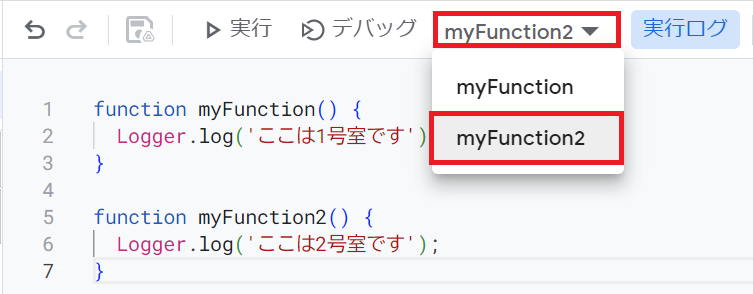
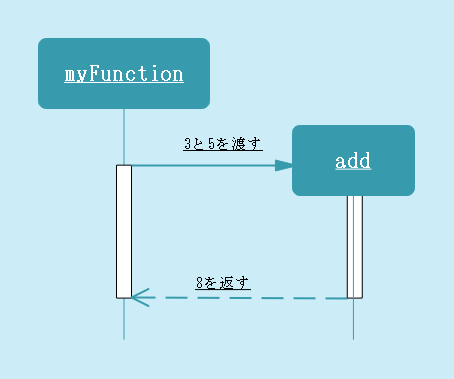

# 関数
変数はデータに名前を付けて再利用する機能でした。これより学ぶ関数は処理に名前を付けて再利用することができます。
<br><br>
他の入門書であればこの機能はもう少し後に紹介されることが多いですが、GASが関数と相性が良いので機能を絞ってここで紹介します。
<br><br>

## いきなり変則的な使い方
次のコードを実行してみましょう。デバッグの右の欄にあるプルダウンメニューから`myFunction`と`myFunction2`を切り替えて実行し、その結果の違いを見てみてください。



GASにはどの関数を実行するか選択できる機能が備わっています。これを応用して、トリガー(例えばボタンを押したとき、起動時など)に応じてどの処理を適応するか選択できるようになっています。なので、「機能ごとに関数を分ける」ということを覚えておいてください。

## まずは習うより慣れろ
次のコードを実行してみましょう。
```Javascript
function myFunction() {
  var n = add(3, 5);
  var n = calcAverage(10, 13, 17, 21, 23);
  Logger.log(n);
}

function add(x, y) {
  const result = x + y;
  Logger.log(result);
  return result;
}

function calcAverage(a, b, c, d, e) {
  const sum = add(add(add(add(a, b), c), d), e);
  return sum / 5;
}
```
まずは`add`関数を見てみましょう。この関数は二つの値を受け取ってその結果を表示し返す関数です。`var n = add(3, 5)`の部分と`function add(x, y)`という部分を見比べると、`x`に`3`、`y`に`5`を適応し、`3 + 5`を行っていそうです。
<br><br>この`x` `y`のことを引数（ひきすう）と言います。`return`という新しい単語が登場しましたね。これは、`add`関数を呼び出した元に値を「返す」キーワードとなっています。まとめると、`add`関数は二つの引数を受け取ってその値を加算した値を返す関数となります。流れが追いにくくなってきたので、またイメージをする時間です。

## 関数の流れのイメージ



筆者は関数を業務委託でイメージしています。`add`という会社があり、必要なデータを渡したら後はお任せで、その結果を返してくれます。ここで重要なのは、委託元は委託先の会社がどのような仕事をしているのか知らなくてよいことです。もう少し役に立つ関数を考えてみましょう。

```Javascript
function myFunction() {
  let playerX = -2;
  let playerY = 3;
  let enemyX = 1;
  let enemyY = -1;
  let distance = calcDistance(playerX, playerY, enemyX, enemyY);
  Logger.log(distance);
}

function calcDistance(x1, y1, x2, y2) {
  const dx = x2 - x1;
  const dy = y2 - y1;
  return Math.sqrt(dx * dx + dy * dy);
}
```

三平方の定理を利用して平面座標(x, y)同士の距離を求める関数です。この例ではプレイヤーと敵の距離を求めています。委託元は距離の求め方を知らなくても距離を求めることができますね。`Math.sqrt(x)`はxの平方根を返す関数です。  
「そんな関数作ってないし平方根の求め方なんて知らないよ」
<br><br>
そうです、この関数は標準ライブラリにて定義されています。標準ライブラリとは、様々な場面で活用できる汎用的な関数群やデータ型をJavaScript(GAS)が予め用意してくれているものという認識で良いです。`Math.`まで入力すると、エディタの補完機能により様々な候補が表示されますよね。これは`Math`に分類されている関数一覧が表示されているのですが、数え切れないぐらいありますね。暇なら色々試してみると面白いでしょう。

## 流れを追いきれ！
最初のコードを再掲します。

```Javascript
function myFunction() {
  var n = add(3, 5);
  var n = calcAverage(10, 13, 17, 21, 23);
  Logger.log(n);
}

function add(x, y) {
  const result = x + y;
  Logger.log(result);
  return result;
}

function calcAverage(a, b, c, d, e) {
  const sum = add(add(add(add(a, b), c), d), e);
  return sum / 5;
}
```

`calcAverage`関数は5つの値を受け取ってその平均を求める関数です。`sum`は素直に`a + b + c + d + e`とすれば求められますが、ここでは`add`関数を経由することでその過程を表示できるようにしています。`add(`がいっぱいあって何をしているのかイメージが付きませんか？順を追って見てみましょう。
<br><br>
`add(add(add(add(a, b), c), d), e)`のうち最初に計算される場所はどこでしょうか。演算子の優先順位の話を思い出してください。

```Javascript
const n = 3 + -add(4 * 2, 5 / 2);
```
この例を見ると、最初に引数、次に`add()`、次に`-add()`、次に`3 + -add()`となります。分かりやすいように番号を振ってみます。
```Javascript
const n = ⑤「3 + ④「-③「add(①「4 * 2」, ②「5 / 2」)」」」;
```
ついてこれていますか、演算子の優先順位が重要って言ったでしょ。これらは徐々に慣れていけばよいと思います。関数呼び出し演算子は算術演算子や単項演算子「`-`」よりも優先順位が高く、引数から計算されることが分かりました。となると、`add(`地獄は次の順で計算されていそうですね。
1. add(a, b)
2. add(①, c)
3. add(②, d)
4. add(③, e)

うん、これなら分かりやすいぞ。もし分からなくなったら、変数を使用して式を途中で分けたり、カッコ()を使って優先順位を明示化するのがよいでしょう。

## 戻り値がない関数
今まで`myFunction`の中で様々なことを試してきましたが、`myFunction`も関数なのであれば`return`を使えるはずですよね。

```Javascript
function myFunction() { 
  Logger.log('Hello');
  return;
}
```

はい、問題無く使用できます。しかし今までと違って`return`の後に返す値がありませんね。実は戻り値がない関数で`return`を省略した場合、自動的にこれを付け足してくれていました、知らぬ知らぬのうちに使っていたんですね。次のコードを実行してみましょう。

```Javascript
function myFunction() { 
  const mistery = showValue(5);
  Logger.log(mistery);
}

function showValue(value) { 
  Logger.log(value);
}
```

無を受け取った`mistery`変数には何が入っているのでしょうか。JavaScript(GAS)においては、`null`が入っているようですね・・・これは大変勘違いしやすい仕様なので注意が必要です。
<br><br>
戻り値がない関数の戻り値は`void`型の`undefined`です。  
「どういうこと？」  
無には2種類ありそれが`null`と`undefined`です。`null`は前回説明しましたね。`undefined`は未定義を意味します。未定義というのは何が入っているか分からないので何が起こるのか分からないことを意味します、なんだか危なそうですよね。
<br><br>
`undefined`の変数にアクセスした際の振る舞いはプログラミング言語によって異なりますが、大抵はエラーになります。本来次のコードの`n`は`undefined`なのですが、JavaScript(GAS)は`undefined`にアクセスする危険性を無くすために自動的に`null`を代入するという仕様になっているんですね。

```Javascript
var n;
```

「戻り値がない関数は危険ってこと？」  
違います、戻り値がない関数というは何かを表示したり内部の状態を変化させたりする場合に使用されます。実務上ではそもそもそれらの関数の戻り値を受け取ろうなんて発想が湧かないので、他言語でも特に気にする必要はなく、安心して使用して構いません。  
「ﾓﾅ……ﾓﾅ……」  
異端者だ！捕まえろ！

## 関数の命名規則
変数と同じように、関数名にもコーディングルールを適応します。基本的なルールは変数の命名規則と同じですが、関数はそれに加えて<span style="color: red;">最初の単語を動詞にする</span>というルールを付け加えます。こうすることにより、一目で関数名なのか変数名なのか分かる事に加えて動詞からどんな値が返ってくるのか推論することができます。

```
function isPrimitiveValue
function doSomething
function initPlayer
```