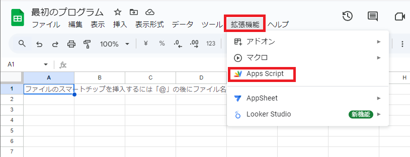
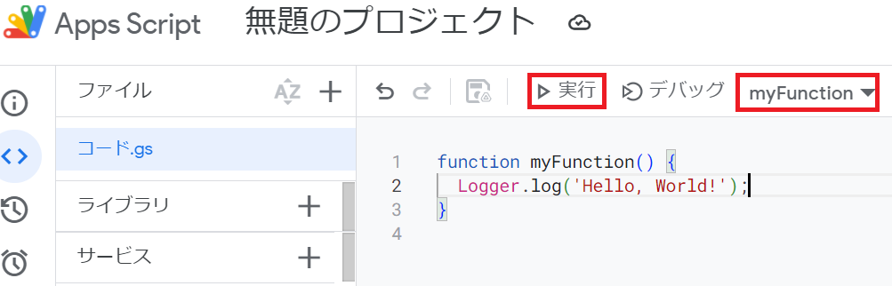

# Hello, World!

プログラミング言語を学ぶ際に、一番初めに`Hello, World!`というテキストを出力する伝統があります。我々もそれに倣ってGoogleAppsScriptで初めてのプログラムを作成してみましょう。

### 最初のプロジェクトを作成する
無題のスプレッドシートを作成し、タイトルを任意の名前に変更します。ここでは「最初のプログラム」にしました。そこから上部にあるメニューの「拡張機能」の「Apps Script」をクリックするとApps Scriptの無題のプロジェクトが作成されます。



### プログラムを書いて実行する
自動でmyFunctionという関数が生成されているのを確認してください。次のように書き、デバッグの横にあるテキストがmyFunctionとなっていることを確認し、実行ボタンを押してみよう。
```Javascript
function myFunction() {
  Logger.log('Hello, World!');
}
```



おめでとう、君はGoogleAppsScriptの世界に迷い込んだ。