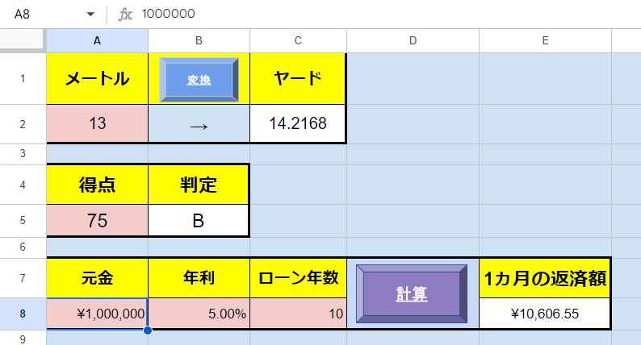
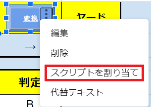
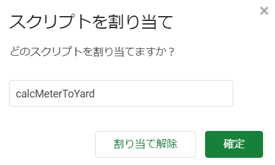

# オリジナルのスプレッドシート関数を作ってみよう（その１）
さて、色々なことを一気に学んだので少し疲れましたか、ついにタイトル回収です。この章の締めくくりとして、GoogleスプレッドシートとGoogle Apps Scriptを実際に連携するプログラムを作成します。作って楽しい遊んで楽しいゲームは次章からです、お楽しみに。

## スプレッドシートから値を受け取る
このコードを実行する前にセル`A1`に任意のデータを入れておいてください。次のコードを実行してみましょう。セキュリティの関係でアクセスの認証を求められます、許可をして問題ありません。途中分かりづらいポイントがありますが、詳細から無題のプロジェクトに移動をクリックしてください。

```Javascript
function myFunction() { 
  const sheet = SpreadsheetApp.getActiveSpreadsheet().getActiveSheet();
  const value = sheet.getRange('A1').getValue();
  Logger.log(value);
}
```


`const sheet = SpreadsheetApp.getActiveSpreadsheet().getActiveSheet();`では、現在アクティブなスプレッドシート全体を取得し、そのスプレッドシート内の現在アクティブなシートを取得しています。`sheet`変数の中に入っているのはSheetオブジェクトというものです、この本では詳しく解説しないですが、様々な関数が入っていて色々な操作が出来そうですね。
<br><br>

`sheet.getRange('A1')`関数で、実際にA1セルにアクセスしています。`getValue()`以外にも様々な関数がありますね、`get○○`系の関数を呼び出せば、A1セルの値以外にも様々な情報を取得できそうですね。

## スプレッドシートに値を反映させる
次のコードを実行してみましょう。

```Javascript
function myFunction() { 
  const sheet = SpreadsheetApp.getActiveSpreadsheet().getActiveSheet();
  sheet.getRange('A2').setValue('あいうえお');
  sheet.getRange('A3').setValue(40).setBackground('#22ffdd').setFontColor('yellow');
}
```

`sheet.getRange()`までは同じ、`get`の逆の`set○○`系の関数を呼び出せばスプレッドシートに様々なデータを反映させることができそうです。
<br><br>
色の設定はカラーコードでなく、直接色の名前を指定することができます。

## いざ実戦へ
今回は次の3つのスプレッドシート関数を作ってみようと思います。
1. メートルからヤードに変換する関数
2. スプレッドシートに標準で備わっている関数を出力する関数
3. ローン返済の1ヵ月の返済額を求める関数

### まずは形から
まずはスプレッドシートを編集して値を受け取る場所と反映する場所を決め、見やすいようにUIを整えましょう。皆さんが分かりやすいようにユーザーが入力するセルを赤色？で表示しています。筆者はUIのセンスが皆無なので皆さん側で何とかしてください。
<br><br
「変換」「計算」は[挿入]→[図形描画]からボタンっぽい図形を作成しています。金額や年利は表示形式の変更を行っています。表示上では`￥1,000,000`でも実際の値は`1000000`なのでご注意ください。



## メートルからヤードに変換する関数
メートルからヤードに変換するには`1.0936`をかければよいです、まずは関数を作ります。

```Javascript
function calcMeterToYard() {
  const sheet = SpreadsheetApp.getActiveSpreadsheet().getActiveSheet();
  const meter = sheet.getRange('A2').getValue();
  sheet.getRange('C2').setValue(meter * 1.0936);
}
```

この関数を「変換」ボタンが押されたときに実行するようにします。「変換」図形を右クリックし縦三点リーダーをクリック、「スクリプトを割り当て」をクリックし割り当てたい関数名を入力し確定します。




`A1`セルの数値を入れ替えて「変換」をクリックし、正しく実行されることを確認してください。どうですか、実際に自分が作ったプログラムが多くの人に利用できる形になり、世界中のメートルからヤードに変換出来なくて困っている人を助けられるようになりました。小さなプログラムですが、これが基礎の形となり、後は「受け取り方」「アルゴリズム」「渡し方」を変えるだけです。

## スプレッドシートに標準で備わっている関数を出力する関数
基本的にはGASで完結するため忘れがちですが、スプレッドシート自体にも様々な関数が用意されていますよね。上手く活用することでGASだからできるアプリケーションも作れるかもしれません(特に良い例は思いつきませんでした)。
ここではセル`A5`の得点を基に、`80点以上なら"A"、60点以上なら"B"、それ以下の点数なら"C"`を出力するスプレッドシート関数を出力していこうと思います。~~次の章で学ぶif文を活用すればこの無駄な遠回りをする必要はありません。~~
<br><br>
条件によって値が変わるので、ここでは`IF関数`が使えそうですね。`IF関数`の記述方法は次の通りでした:

```
=IF(条件式, 真の場合の値, 偽の場合の値)
```

例えば`A5`が80以上なら`"A"`、それ以外なら`"B"`としたい場合は次のように記述します:

```
=IF(A5>=80, "A", "B")
```

条件分岐については次の章でより詳しい解説をしているので良ければそちらもご覧ください。この例では`A5`の値が変更された場合、それに連動してこのセルの値も更新されます。今回は敢えて`A5`の値を直接代入し、変化しないようにしてみようと思います。`calcMeterToYard`の下に成績を評価するIF関数を出力する`outputEvalGrade`関数を作ってみましょう。おっとその前に、文字列に関する便利な機能を紹介します。`myFunction`で実験を行います。
```Javascript
function myFunction() { 
  const name = 'ああああ';
  const age = 24;

  var text = '勇者' + name + '(' + age + '歳)の冒険';
  Logger.log(text);
  var text = `勇者${name}(${age}歳)の冒険`;
  Logger.log(text);
}
```
文字列の中に変数の値を混ぜたい時、従来の方法では少し面倒に感じませんでしたか。そのような時は「'」の代わりに「\`」で囲い、`${変数名}`とする事で文字列の中に自然に混ぜることができるようになります。
<br><br>
気を取り直して、`outputEvalGrade`関数を作ってみましょう。`A5`セルの値を直接代入するので、先ほどの機能が活躍しそうです。

```Javascript
function outputEvalGrade() {
  const sheet = SpreadsheetApp.getActiveSpreadsheet().getActiveSheet();
  const grade = sheet.getRange('A5').getValue();
  const output = `=IF(${grade} >= 80, "A", IF(${grade} >= 60, "B", "C"))`;
  sheet.getRange('B5').setValue(output);
}
```

単純ですが文字列として直接スプレッドシートの式を書くことで実現できました、しかしこの関数を実行するボタンがありません。

#### メニューからスクリプトを実行する
ボタン以外にもスクリプトを実行する方法があります。メニュー欄にスクリプトを実行する機能を設置することで、スプレッドシートのどこからでも実行することができるようになります。


#### メニューの追加
メニューに独自の項目を追加したい場合もGASから操作することができます、次の関数を作ってみましょう。スプレッドシートを更新すればメニューに「スクリプト実行」の項目が追加されているはずです。

```Javascript
function onOpen() {
  const ui = SpreadsheetApp.getUi();
  const menu = ui.createMenu('スクリプト実行');
  menu.addItem('成績評価', 'outputEvalGrade');
  menu.addToUi();
}
```
早速実行してみましょう、得点を変えてきちんと動作するか確認してみてください。~~連動して切り替わらないので不便ですね。~~

#### 特別な関数
Google Apps Scriptは特定の関数名を持つ関数に特別な振る舞いを持たせています、`onOpen`もその一つです。`onOpen`はスプレッドシートを開いた際に自動的に実行される関数です。他にもいくつかの種類がありますのでこれらの名前は使用せず開けておくようにしましょう。  
[シンプルなトリガー](https://developers.google.com/apps-script/guides/triggers?hl=ja)
<br><br>
セキュリティの関係でこれらの関数が実行されない場合があります、その際は手動でトリガーを設定する方法を検討してください。