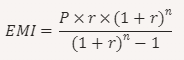

# オリジナルのスプレッドシート関数を作ってみよう（その２）
最後に、元金、年利、ローン年数から1ヵ月の返済額を計算する関数を作ってみましょう。返済額は次のルールに基づいて決めます。
1. 1ヵ月に1回返済を行う
2. 複利法を採用する

複利法の詳しい説明については各自調べてください、今回重要なのはどうやったら返済額を求められるかです。毎月の支払額（EMI: Equated Monthly Installment）を求める計算式は次の通りです:


ここで、
* _EMI_ は毎月の支払額
* _P_ は元金（Principal）
* _r_ は月利（年利を12で割ったもの）
* _n_ はローン期間の月数

うーん難しそうですね、一旦、側だけ用意しておきましょうか。

```js
function calcRepayment() {
  const sheet = SpreadsheetApp.getActiveSpreadsheet().getActiveSheet();
  sheet.getRange('E8').setValue(0);
}
```

## myFunctionで試行錯誤してみる
`calcPepayment`関数は本番で使用するための関数です。動くか分からないものを毎回ボタンを押してチェックするのは面倒です、まずは正解のアルゴリズムを`myFunction`で試行錯誤しながら作ってみましょう、ここなら自由にデバッグ用のコードを使用できます。
<br><br>
正解の値が分からないと話になりませんね、テストケースを用意します。

***
データセット 1
* 元金: ¥1,000,000
* 年利: 5%
* ローン年数: 10年
* 毎月の返済額: 約 ¥10,606.55
***
データセット 2
* 元金: ¥2,000,000
* 年利: 3%
* ローン年数: 15年
* 毎月の返済額: 約 ¥13,805.87
***
データセット 3
* 元金: ¥500,000
* 年利: 4.5%
* ローン年数: 5年
* 毎月の返済額: 約 ¥9,320.51
***
データセット 4
* 元金: ¥3,000,000
* 年利: 6%
* ローン年数: 20年
* 毎月の返済額: 約 ¥21,493.57
***

まず年利とローン年数を月利とローン月数に変換しないといけませんね、一見、式が長そうですが(1 + r)^nが2回登場しているので変数を活用できそうです。
```js
function myFunction() { 
  const princ = 1000000;
  const mInterest = 0.05;
  const termMonths = 10 * 12;
  const compFactor = Math.pow(1 + mInterest, termMonths); 
  const repayment = (princ * mInterest * compFactor) / (compFactor - 1);
  Logger.log(repayment);
}
```
`Math.pow`はべき乗を求める関数です。うーん、動いたけど省略した変数名がいっぱいあって何を表しているか分からないぞ。かといって全ての単語を書くと長すぎるし・・・
## コメント
実はコードだけを見て何をしているのか分かるプログラマーなんて余程熟達した人かロボットぐらいなものです。大抵の人は、コードに付けられた`コメント`を読んで内容を理解します。ちょっと付けてみましょう。

```js
function myFunction() { 
  // 複利法のローンの元金と年利と年数から月々の支払額を計算する

  // 元金
  const princ = 1000000;
  // 月利
  const mInterest = 0.05;
  // ローン月数
  const termMonths = 10 * 12;
  const compFactor = Math.pow(1 + mInterest, termMonths); 
  // 月々の支払額
  const repayment = (princ * mInterest * compFactor) / (compFactor - 1);
  Logger.log(repayment);
}
```
なんということでしょう、一目で何をしているのか分かるようになりました。
<br><br>
`//`から改行までは`コメント`という扱いになり、プログラムに認識されなくなります。コメントを何の言語で書くかは所属するコミュニティによって異なりますが、可能限り自分にとって読みやすいようにしたいです。
<br><br>
複数行を`コメント`にしたい場合は`/* */`を使用します。
```js
/*この行も
この行も
この行もコメントです。
この行も*/
```

## 仕上げ
これらを踏まえて`calcRepayment`関数を完成させましょう。関数が完成したらヤード変換の時と同じように「計算」ボタンに`calcRepayment`を割り当てます。

```js
// 複利法のローンの元金と年利と年数から月々の支払額を計算する
function calcRepayment() {
  const sheet = SpreadsheetApp.getActiveSpreadsheet().getActiveSheet();
  // 元金
  const princ = sheet.getRange('A8').getValue();
  // 月利
  const mInterest = sheet.getRange('B8').getValue() / 12;
  // ローン月数
  const termMonths = sheet.getRange('C8').getValue() * 12;
  const compFactor = Math.pow(1 + mInterest, termMonths); 
  // 月々の支払額
  const repayment = (princ * mInterest * compFactor) / (compFactor - 1);
  sheet.getRange('E8').setValue(repayment);
}
```

お疲れ様でした、一部解説を省略しながら駆け足で走り抜けたので理解が追いついていない箇所もあるかと思います。動作のイメージが掴めない箇所は実際に色々試行錯誤して「何故何」を一つずつ解消してみてください。  
「`const sheet = SpreadsheetApp.getActiveSpreadsheet().getActiveSheet();`のところがよく分かりません。`.`ってなんですか」  
`.`は日本語でいうと「～の中の」に当たります、「SpreadsheetAppの中のスプレッドシートの中のシート」といえば分かりやすくなりますかね。この辺について詳しく解説しようとするとかなり先の内容まで解説する必要が出てきてしまいます。所謂「おまじない」というやつで、例えば小学校の頃、円の面積を求める公式は半径x半径x3.14だよと教わったと思います。何故その式なのか、何故円周率は3.14なのかを小学生が理解するのは難しいですよね。それと同じで、これらについては何となくこう書くんだなと思っていただければ十分です。それにこれらの「おまじない」は毎回登場するので手癖で書けるようになります。