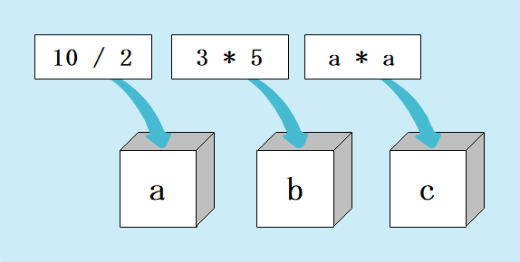

# 変数（その１）
現状ではただのデカい電卓としての使い道しかありません。これより学ぶ変数を使いこなせれば簡単なゲームを作れるようになるでしょう。
<br>
<br>
次のコードを実行してみましょう。

```Javascript
function myFunction() {
  var a = 10 / 2;
  var b = 3 * 5;
  var c = a * a;
  Logger.log(a + b);
  Logger.log(c);
}
```

今までは計算結果を保存しておく事ができませんでしたが、変数を利用することで可能になりました！勿論、数値以外にも文字列やあらゆるデータ型を入れることができます。

## 変数のイメージ


筆者は変数を箱でイメージしています。箱にラベルを付けてデータを入れておきます。データが必要になったら箱から取り出して値を見た後、箱に戻すイメージです。
<br><br>
イメージする物は何でも構いませんが、プログラムの世界の抽象的な概念を自分の中で何かに例える事が出来ると理解が早まります。

## 変数のメリット1
変数を知る前のコードと見比べてみましょう。

```Javascript
function myFunction() {
  Logger.log((10 / 2) + (3 * 5));
  Logger.log((10 / 2) * (10 / 2));
}
```
式が長くなり見づらくなってきましたね。変数を利用することで、同じ式を１箇所にまとめることができます。

## 変数のメリット2
上記の例で、10を8に変更するとしましょう。変数を利用している側は、変数aの１箇所を変更すれば済みますね。そうでない側は、10が登場した回数分だけ手直しする必要があります。変数を利用することで、修正のしやすさが格段に上がります。

## 変数のメリット3
もう少し実戦的な例を見てみましょう。

```Javascript
function myFunction() {
  Logger.log(5 * 2 * 3.14);
}
```

```Javascript
function myFunction() {
  var radius = 5;
  var height = 2;
  var pi = 3.14;

  var volume = radius * height * pi;
  Logger.log(volume);
}
```

円柱の体積を求めるコードを作ってみました。上と下で実行時の出力は一緒ですが、上のコードの数字は何を意味しているのか分かりません。変数として数値に名前を付けることで、そのコードが何を意味しているのか分かるようになります。
<br><br>
<span style="color: red;">変数名はその意図にあった名前にしましょう</span>。

## 変数の命名規則
変数名は最初の文字は数字禁止、二文字目以降は数字も文字も指定することができます。
```Javascript
var a123Bc_Def
```
次のコードを見てください。
```Javascript
function myFunction() {
  var プレイヤーネーム = "ああああ";
  Logger.log(プレイヤーネーム);
}
```
実はアルファベット以外に日本語等も使用できます、日本人ならこちらのほうが分かりやすそうですね。自分しか使わないアプリであれば、変数名は自由に付けて良いと思いますが、実際は様々な人がプロジェクトに携わり、グローバルな現代では海外の人と仕事をすることも珍しくありません。コードをインターネットに公開する際は必然的に英語を使うことになるでしょう。多くの人が変数名を自由に付けたら言語もお決まりもバラバラになってしまいます。そこでコーディングルールを定め、誰が書いても同じようになるようにすることで、コードの可読性を高めることが出来ます。
<br><br>
コーディングルールはコミュニティによって様々ですが、我々は変数名を付けるにあたって次のルールを厳守します。

* 英語を使用する
* 意図が分かる名前にする
* 変数名が複数単語になる場合、キャメルケースを使用する
* 単語が長くなる場合は略称の使用を許可する

## キャメルケースとは？
`player name`や`get user data`など単語が複数ある場合、` `(スペース)を使用することはできません。その代わりに次のルールを適応します。

* ` `(スペース)の代わりに、` `(スペース)の次の文字を大文字にする


百聞は一見にしかずです。
```
playerName
getUserData
```
