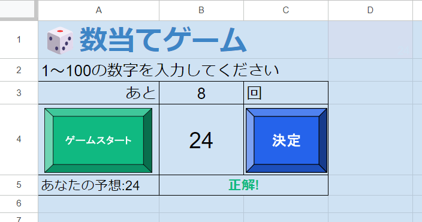

# ゲームの仕様と枠組みの作成

## ゲームルール
数当てゲームのルールを確認しましょう。もし友達をお持ちの方がいらっしゃったら実際に遊んで確かめて見てください、おひとりでも結構です。

1. ホストは1～100の中でランダムな数字をひとつ定める
2. プレイヤーは一定回数以内にその数字を当てることが出来たら勝ち、できなかった場合は負け
3. ホストはプレイヤーが数字を予想した際、思い浮かべた数字がその数字より「大きい」か「小さい」か、あるいは「正解」であるかのヒントを与える

## スプレッドシートを活用した仕様
このゲームでは「ゲームを初期化する関数」と「判定を行いその結果を反映する関数」の間で正解の値を共有する必要があります。しかしボタンに割り振られた関数を実行し終わるとGASの変数が全て消えてしまうため、通常のアプローチであればゲームプレイ中ずっとGASを起動し続けなければいけませんが、丁度良いところにメモ帳がありますね。
  
[プレビュー映像](./Title.md)をよーく見てもらうと分かるのですが、`D1`セルに答えの数値を記録しており、文字色を背景色と同じにすることでプレイヤーから隠しています。ゲーム中周りのセルをあっちこっちクリックする人対策でもっと離れたところに記録すれば証拠隠滅完了です。同様に残り回数の記録もスプレッドシートを利用します。

## 枠組みの作成

まずは仮のテキストを入力してUIを作ってみましょう。`B5`セルと`C5`セルはセルの結合を行っています、セルの結合を行った際にどのセルを指定すれば良いかも考えてみてください。例によって皆さまがより優れたUIを作っていただいて構いません。その際、背景色や入出力するセルの位置を調整してください。