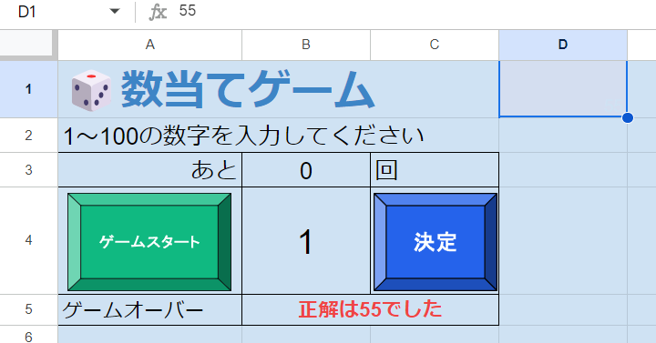

# 決定ボタンの作成


「決定」ボタンが押された際に何をする必要があるかリストアップしましょう。

* `B4`セルのプレイヤーの予想と`D16`の正解の数を比較する
* 値が違った場合はヒントを表示し残り回数を1減らす
* 正解だった場合は「正解！」と表示する
* 既定回数以内にクリアできなかったら「ゲームオーバー」と正解の値を表示ゲームを終了する
* ゲームオーバーになったらボタンが押されても正誤判定を行わないようにする
* エラーチェック

〇〇だったら〇〇という処理のオンパレードですね、エラーチェックもこれに含まれます。

## 正誤判定
早速「決定」ボタンに紐づける`guess`関数を作り、ゲームの根幹部分を作ってみましょう:

```Javascript
// 決定ボタンが押されたときに実行する関数
function guess() {
  const sheet = SpreadsheetApp.getActiveSpreadsheet().getActiveSheet();
  const guessNum = sheet.getRange('B4').getValue();
  const correctNum = sheet.getRange('D1').getValue();
  const countCell = sheet.getRange('B3');
  const statusCell = sheet.getRange('A5');
  const resultCell = sheet.getRange('B5');

  // 正誤判定
  statusCell.setValue(`あなたの予想:${guessNum}`);
  if (guessNum < correctNum) {
    resultCell
      .setValue('もっと大きい数字です↑')
      .setFontColor('#f86363');
    // 残機を1減らす
    countCell.setValue(countCell.getValue() - 1);
  } else if (guessNum > correctNum) {
    resultCell
      .setValue('もっと小さい数字です↓')
      .setFontColor('#3b82f6');
    // 残機を1減らす
    countCell.setValue(countCell.getValue() - 1);
  } else {
    resultCell
      .setValue('正解!')
      .setFontColor('#10b981');
  }
}
```
根幹部分は凄くシンプルですね、この時点でゲームとしては動作するので、実際にゲームスタートから一連の流れを確認してみましょう。無事クリアすることができましたか、まだゲームオーバーに関する処理を作っていないので無限回チャレンジできますね。

## 定数オブジェクト
ちょっとUIを豪華にするために、処理に応じて表示するテキストの色を変えてみました。でも色がピンと来ないので変更したいな、こういう時は定数を使用するのが便利でした。今回の場合、定数にしたいものは全て文字色です。定数オブジェクトを使用すれば、これらの同じグループの定数を一括りにして見やすく、使いやすくすることができます。

### 定数オブジェクトの定義
今回のゲームの例では次のように行います:
```Javascript
const COLOR = {
  BACKGORUND: '#cfe2f3',
  LESS: '#f86363',
  GREATER: '#3b82f6',
  CORRECT: '#10b981',
  GAMEOVER: '#ef4444'
};
```
定数オブジェクトは`const グループ名 = { 定数: 値, ... }`とすることで定義することができます。見やすいだけでなく、全ての定数名から`COLOR`を省略できるので面倒くささも減らすことができます。前回の`BACKGROUND_COLOR`もここに所属させてしまいましょう、そして次で使用する`GAMEOVER`時の色もここで定義してしまいましょう。

### 定数オブジェクトの使用方法
まずは`BACKGROUND_COLOR`を置き換えてみましょう:
```diff
// ゲームスタートボタンが押された時に実行する関数
function init() {
  ・
  ・
  correctNumCell
    .setValue(correctNum)
+   .setFontColor(COLOR.BACKGORUND);
-   .setFontColor(BACKGROUND_COLOR);
  ・
  ・ 
}
```
`グループ.定数`で使用することができます。同じ要領で他の色も置き換えてみましょう:
```diff
// 決定ボタンが押されたときに実行する関数
function guess() {
  ・
  ・
  // 正誤判定
  statusCell.setValue(`あなたの予想:${guessNum}`);
  if (guessNum < correctNum) {
    resultCell
      .setValue('もっと大きい数字です↑')
+     .setFontColor(COLOR.LESS);
-     .setFontColor('#f86363');
    // 残機を1減らす
    countCell.setValue(countCell.getValue() - 1);
  } else if (guessNum > correctNum) {
    resultCell
      .setValue('もっと小さい数字です↓')
+     .setFontColor(COLOR.GREATER);
-     .setFontColor('#3b82f6');
    // 残機を1減らす
    countCell.setValue(countCell.getValue() - 1);
  } else {
    resultCell
      .setValue('正解!')
+     .setFontColor(COLOR.CORRECT);
-     .setFontColor('#10b981');
  }
}
```

## ゲームオーバーになった時の処理

### ゲームオーバーチェック
まずは正誤判定の後に残り回数が0になっていたらゲームオーバーになるようにしましょう:
```Javascript
// 決定ボタンが押されたときに実行する関数
function guess() {
  ・
  ・
  // 正誤判定
  ・
  ・
  } else {
    resultCell
      .setValue('正解!')
      .setFontColor(COLOR.CORRECT);
  }

  // ゲームオーバーかチェックする
  if (countCell.getValue() <= 0) {
    statusCell.setValue('ゲームオーバー');
    resultCell
      .setValue(`正解は${correctNum}でした`)
      .setFontColor(COLOR.GAMEOVER);
  }
}
```
実行して見ましょう、残り回数が0になった時にゲームオーバーと表示できましたね。もし10回もボタンを押すのが面倒なら完成するまでは残機を少なくしておくのがいいでしょう。`countCell`の値の比較を`===`ではなく`<=`で行っています、仕様上はどちらでも良いですが、何かの拍子に残機がマイナスになってしまってもきちんと動作する`<=`を使用したほうが確実ですね。

### ゲームオーバーになったら正誤判定以下を行わないようにする
現状ではゲームオーバーになった後もボタンを押したら正誤判定が行われて残機が減り続けてしまいます。余計な処理を行わないようにするには、正誤判定よりも前に残機のチェックを行い「早期`return`」をすればよいです:
```Javascript
function guess() {
  ・
  ・
  const resultCell = sheet.getRange('B5');

  // ゲームオーバーの場合は終了する
  if (countCell.getValue() <= 0) {
    return;
  }

  // 正誤判定
  statusCell.setValue(`あなたの予想:${guessNum}`);
  ・
  ・
```
これで残り回数が0未満にならないようにできました。

## 早期リターン
制御文と`return`を組み合わせることによって、エラーなどの際にそこで処理を打ち切ることができます。これにより次の3つのメリットがあります:
* 想定外のデータを処理してしまわないようにする
* エラーチェックの後のコードは想定外のデータのことを考える必要がない
* 余計な処理を行わない分実行速度が速くなる

例えば素数判定を行う関数を作る際、2以外の偶数は全て素数ではないですよね、1も素数ではありません。この時点で1と偶数をフィルタリングする事ができ、以後は3以上の奇数のみを考慮すればよいです。とても便利なので積極的に活用していきましょう。
<br><br>
正誤判定が正解だったときのコードを見てください、正解だった場合はゲームオーバーチェックが必要ありませんね。今回の場合は論理的に正解の後にゲームオーバーになってしまうことはありませんが、今後不正解だった場合の処理を付け加える際に正解の時も処理してしまう可能性があります。早期リターンの練習として正解だった場合はその場で終了するようにしてみましょう:

```diff
function guess() {
  ・
  ・
  } else {
    resultCell
      .setValue('正解!')
      .setFontColor(COLOR.CORRECT);
+   return;
  }

  // ゲームオーバーかチェックする
  ・
  ・
```

## エラーチェック
プレイヤーは何をしでかすか分かりません、あらゆる状況に備えて対策を打っておかなければいけません。現状発生しうるエラーをリスト化してみます:
* ゲーム開始を押さずに数字を当てようとする
* 入力欄に文字列を入れる
* 入力欄に1～100以外の数字を入れる
* 入力欄に小数を入れる
全く困ったものですが、これらの状況の時の場合は早期リターンをするようにしてあげましょう。

### ゲーム開始を押さずに数字を当てようとした場合
この判定を行うにはどうすればいいでしょうか。ゲーム開始を押していないということはまだ正解の数字が決まっていないということです、我々だけが知る秘密のセルを見ればその判定が行えそうです。

```Javascript
function guess() {
  ・
  ・
  // ゲームオーバーの場合は終了する
  if (countCell.getValue() <= 0) {
    return;
  }
  // エラーチェック
  // ゲーム開始を押さずに数字を当てようとした時
  if (!Number.isInteger(correctNum)) {
    Browser.msgBox('ゲームスタートを押してください');
    return;
  }
  ・
  ・
// 正誤判定
  statusCell.setValue(`あなたの予想:${guessNum}`);
```

ちょっと見慣れない条件式ですね、`correctNum`には秘密のセルの値が入っています。このセルが空かどうかをチェックすればよさそうですが、万が一プレイヤーが至る所にデータを書き込む変人だった場合にも対応させるために「秘密のセルの値が整数でない場合」という条件式にします。
<br><br>
`Number.isInteger(value)`は`value`が整数かを判定する関数で、戻り値が論理型(`ture` or `false`)です。`!false`とした場合`true`になったのを覚えていますか、これを組み合わせると`!is〇〇`は〇〇でない場合という表現にすることができます、すなわち`!isInteger`は整数でない場合ということですね。
<br><br>
`Browser.msgBox(text)`関数を使用することで画面の真ん中にメッセージボックスを表示させることが可能です、ど真ん中に表示してあげればルールを知らない人も否が応でも気付くことでしょう。

### 入力欄が規定外のデータの場合
ここでは、OR演算子(`||`)を活用してデータが整数でない場合と1～100でない場合の両方をまとめて成敗します:
```Javascript
function guess() {
  ・
  ・
  // エラーチェック
  // ゲーム開始を押さずに数字を当てようとした時
  ・
  ・
  // 入力欄が規定の範囲の数値でない時
  if (!Number.isInteger(guessNum) || guessNum < MIN_NUM ||  MAX_NUM < guessNum) {
    Browser.msgBox(`${MIN_NUM}～${MAX_NUM}の半角数字を入力してください`);
    return;
  }

  // 正誤判定
  statusCell.setValue(`あなたの予想:${guessNum}`);
  ・
  ・
```
<br><br>
お疲れ様でした、これで数当てゲームは完成です。今回は`if`地獄でしたね、ゲームというは条件分岐の連続です、ルールがシンプルな数当てゲームもこれだけif文が必要なのですから、大規模なゲームはとんでもない`if`地獄になっていそうです。特にゲーム本体が完成したのにエラー処理を長々と書かされたのは辛かったでしょう、これに懲りたらゲームで壁に埋まろうとしたりボタンを同時押ししたりしようとしないでくださいね。