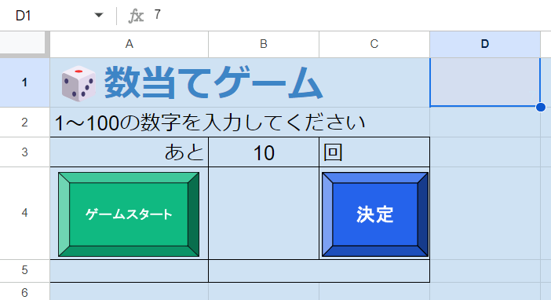

# スタートボタンの作成



「ゲームスタート」が押された際に何をする必要があるかリストアップして整理しましょう、前のゲームのお掃除も忘れてはいけません。

* 1～100の間のランダムな数字を決定する
* 残り回数を初期化する
* 入力欄、結果表示欄を空にする

## 乱数
ランダムな数字ってどうやって作るんでしょうか、スプレッドシートには`RAND`関数がありましたね。GASでは`Math.random`関数を使用します:

```Javascript
function myFunction() {
  // ①
  const value = Math.random();
  Logger.log(value);
}
```

振る舞いは`RAND`関数と同じで、0以上1未満の範囲のランダムな小数を返します。しかし今回必要なのは1以上100以下の整数ですよね、値を加工してそうなるようにしてみましょう:

```Javascript
function myFunction() {
  // ①0以上1未満の小数
  var value = Math.random();
  Logger.log(value);
  // ②0以上100未満の小数
  var value = value * 100;
  Logger.log(value);
  // ③0以上100未満の整数
  var value = Math.floor(value);
  Logger.log(value);
  // ④1以上100以下の整数
  var value = value + 1;
  Logger.log(value);
}
```

`Math.floor`関数は小数点以下を切り捨てる関数です。注目するべきは④で、③までで生成した乱数に`1`を足すことで1以上100以下の条件を達成しています。5以上100以下の乱数を生成した場合は、`Math.floor(Math.random() * 96) + 5`で求められます。一般化してみましょう:

```Javascript
// min以上max以下の乱数を生成する
function randBetween(min, max) {
  return Math.floor(Math.random() * (max - min + 1)) + min;
}
```

この手順を応用すれば任意の範囲の乱数を作れそうですね。

## init関数の作成
必要な食材が揃いました、早速ボタンが押されたときに実行される`init`関数を作ってみましょう:

```Javascript
// ゲームスタートボタンが押された時に実行する関数
function init() {
  const sheet = SpreadsheetApp.getActiveSpreadsheet().getActiveSheet();
  // 残り回数を初期化
  sheet.getRange('B3').setValue(10);
  // 正解の値をセット
  const correctNum = randBetween(1, 100);
  const correctNumCell = sheet.getRange('D1');
  correctNumCell
    .setValue(correctNum)
    .setFontColor('#cfe2f3');
  // フィールドをクリア
  sheet.getRange('A5').setValue('');
  sheet.getRange('B4').setValue('');
  sheet.getRange('B5').setValue('');
}
```
早速「ゲームスタート」と`init`を紐づけて実行してみましょう、制作者だけが知っている秘密のセルに答えが入っていますね。

## 定数
先のコードにはいくつか気になる点があります、`setValue(10)`や`#cf2ef3`です。我々はルールを知っているため、`10`は残り回数、`#cf2ef3`は背景色を意味していることが分かりますが初めて見る人にはちょっと分かりづらいですよね。変数を使用してデータに名前を付けても良いのですが、より適切なアプローチを取ることで変更に強いプログラムを作ることができます。
<br><br>
`myFunction`よりも上、1行目に次のように定義をしてみましょう:

```Javascript
const CALLENGE_NUM = 10;
const MIN_NUM = 1;
const MAX_NUM = 100;
const BACKGORUND_COLOR = `#ef4444`;

function myFunction() {
  Logger.log(randBetween(MIN_NUM, MAX_NUM));
}
```
書き方は変数定義と同じですね、JavaScript(GAS)はイミュータブルな変数と定数を区別しないので実際にこれはただの変数定義なのですが、定義を行う場所を一番上にして命名規則を定数のものにしているので見せかけ上は他言語の定数のようになっています。これを使って`init`関数を修正しましょう:

```diff
// ゲームスタートボタンが押された時に実行する関数
function init() {
  const sheet = SpreadsheetApp.getActiveSpreadsheet().getActiveSheet();
  // 残り回数を初期化
+ sheet.getRange('B3').setValue(CALLENGE_NUM);
- sheet.getRange('B3').setValue(10);
  // 正解の値をセット
+ const correctNum = randBetween(MIN_NUM, MAX_NUM);
- const correctNum = randBetween(1, 100);
  const correctNumCell = sheet.getRange('D1');
  correctNumCell
    .setValue(correctNum)
+   .setFontColor(BACKGROUND_COLOR);
-   .setFontColor('#cfe2f3');
  // フィールドをクリア
  sheet.getRange('A5').setValue('');
  sheet.getRange('B4').setValue('');
  sheet.getRange('B5').setValue('');
}
```

### 定数のメリット
定数のメリットは変数と同じようにデータの意味を分かりやすくしたり一括変更出来るほかに、ゲームの仕様が変わった際に修正する可能性があるパラメータ群をまとめて置いておくことができるというものがあります。例えば背景色の変更や残り回数を増減させたいとなった時に、従来の方法ではどこにその変数が定義されているのか探しに行く必要がありましたが、それらが一番上にまとまって置いてあるのでプログラマでない人でもコードを修正することができそうです。

### 定数の命名規則
定数名はアッパースネークケースを使用するのが一般的です、変数名とルールを分けることで一目で定数であることが判断できます。

### アッパースネークケース
アッパースネークケースのルールは以下の通りです:

* 全て大文字で表現する
* ` `の代わりに`_`を使用する

```
PLAYER_NAME
WINDOW_SIZE_X
```