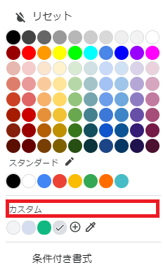
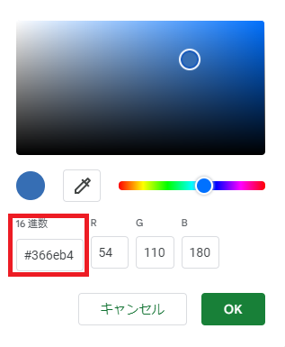

# カラーコード
UIをより豊かにする方法として最も簡単なものは彩りを加えることでしょう。ここでは文字や背景の色を指定するカラーコードについて解説します。
## RGBとは？
カラーコードは基本RGBで指定します。RGBはぞれぞれR(Red)G(Green)B(Blue)の略で光の三原色を表していて、これらを組み合わせて色を作成します。
それぞれの値は通常0から255までの範囲で表現します。例えば：
* 純粋な赤: (255, 0, 0)
* 純粋な緑: (0, 255, 0)
* 純粋な青: (0, 0, 255)
* 白: (255, 255, 255)
* 黒: (0, 0, 0) 
 
そしてこれらを16進数で表し頭に#を付けることで一つの色を表現できます。上の例をカラーコードにすると次のようになります：
* 純粋な赤: #ff0000
* 純粋な緑: #00ff00
* 純粋な青: #0000ff
* 白: #ffffff
* 黒: #000000

任意の色のカラーコードを取得したい場合、スプレッドシートの色の変更画面からカスタムをクリックし、16進数の値をコピーすればよいです。

また主要なカラーコードの一覧をリストアップしているWebサイトがあるのでそちらを参照するのもよいでしょう。  
[WEB色見本原色大辞典](https://www.colordic.org/)  
また各値を0～255ではなく0.0～1.0で表現することもあります。

## その他のカラーコード
カラーコードにはRGB以外にもRGBAやHSVがよく利用されます。
### RGBA
RGBに加えA(Alpha値)が加わったコード。アルファ値とは不透明度のことで、0.0(完全に透明)～1.0(透明でない)までの値で指定します。
半透明の緑を作りたい場合は次のように指定します:
* 半透明な緑: (0, 255, 0, 0.5)
### HSV
HSVはH(hue)S(saturation)V(value)の略で、それぞれ色相、彩度、明度の頭文字を取ったものです。人間の直感に近い色の表現が得意でイラストレーターなどが好んで使用します。
